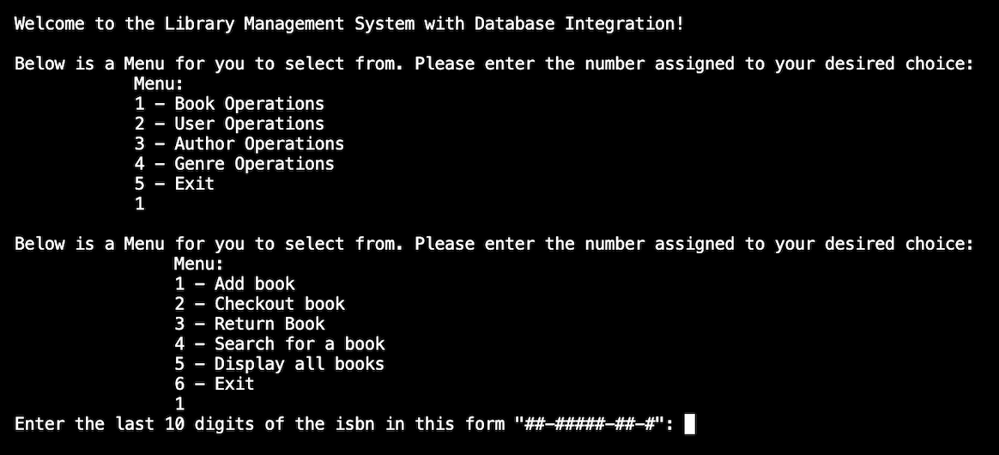

# Library Management System with Database Integration Application 

**This application allows the user to create and maintain a library management system with database integration. It starts by greeting the user then gives the user a menu to select a choice from on what they would like to do within the application.** _(See welcome message below & picture of the menu for example)_

## _"Welcome to the Library Management System with Database Integration!"_

### How it works:
**The user will choose a number from the menu and from there they will be prompt to answer questions on what they would like to do next, navigating them through the application.**

*Here is an example to go along with the photo above:*
- The user is greeted by the welcome message then immediately asked to make a selection from the menu. The user choose's "1" which is "Book Operations" so the user is then prompt to select an option from the next menu. 

- When the user chooses "1", which is to "add book" they will be asked for things such as the books isbn, title, publication date, author ID, or genre ID.

- After entering in the requested info, the system will let you know the book was added successfully!

**Any time the user gets done entering information in a particular area OR if the user enters invalid information it will take them back to the menu to select a choice. When the user is done using the library management system with database integration they can simply select "5" from the main menu and it will thank the user and end the application.**

### Additional Features:
- The application has checks for valid isbn and book publication date.

- The application stores users of the library that can be viewed or searched; a list of any particular user's borrowed books can also be displayed. 

- Authors can be added or displayed with a short biography about the author and assigned to books.  

- Genre's can be added or displayed with a genre category and assigned to books. 

*link to GitHub Repository --> [Library Management System with Database Integration](https://github.com/Kayla-Ard/Library_Management_System_with_Database_Integration/tree/main/%20Library%20Management%20System%20with%20Database%20Integration%20Project*